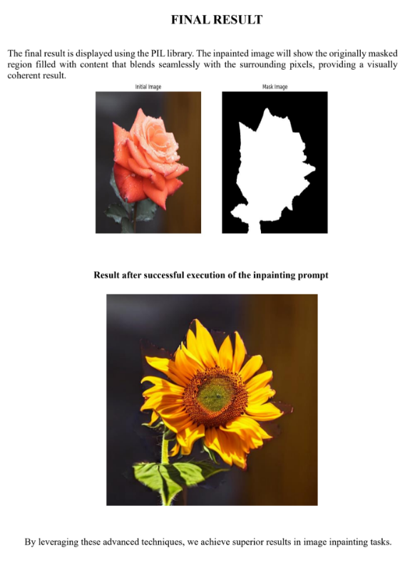

# Image-Inpainting-with-grabcut-and-stablediffusion
This project explores the enhancement of image inpainting using GrabCut segmentation and Stable Diffusion algorithms. By using the GrabCut algorithm, image segmentation is performed, and the generated mask from the segmentation is provided to the Stable Diffusion algorithm. With the help of a prompt, a new image is generated according to the specified prompt, ensuring superior image reconstruction, maintaining visual coherence, and effectively handling complex backgrounds.

## Install the Required Packages:
```pip install PyQt5 opencv-python numpy```
## Run the Application:
```python main.py```
## Save the Mask:
- Click on the Save Mask option to save the mask generated by the GrabCut algorithm.
## Using Google Colab for Diffusion Inpainting
- Upload the Original Image and Mask Image:
  - Go to the provided Colab file (link to your Colab notebook).
  - Upload the original image and the saved mask image.
- Write the Prompt and Execute Inpainting:
  - Write the desired prompt in the Colab notebook.
  - Run the notebook cells to see the diffusion inpainting process and generate the new image.
## Final-result

